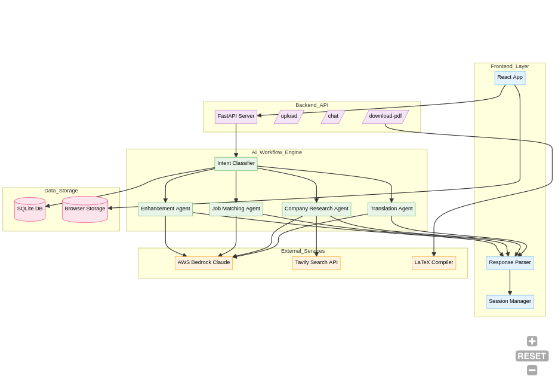
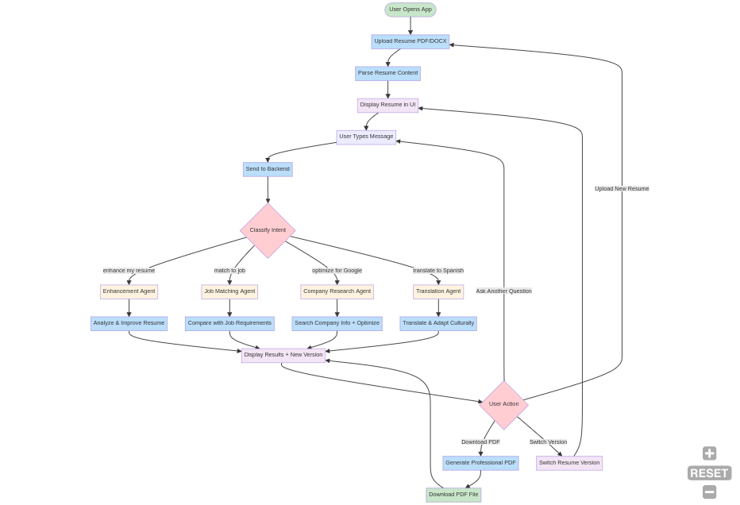
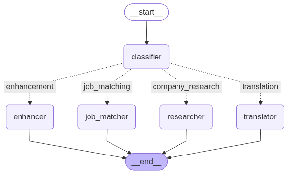

# 🚀 Resume Agent - AI-Powered Resume Optimization Platform

An intelligent resume optimization platform that uses AI agents to enhance, translate, and tailor resumes for specific jobs and companies with real-time research capabilities.

## 📋 Table of Contents
- [Features](#-features)
- [Architecture](#-architecture)
- [Quick Start](#-quick-start)
- [AI Agents](#-ai-agents)
- [Tech Stack](#-tech-stack)
- [Installation](#-installation)
- [Usage](#-usage)
- [API Documentation](#-api-documentation)
- [Contributing](#-contributing)

## ✨ Features

### 🤖 **4 Specialized AI Agents**
- **Enhancement Agent**: Improves resume content with quantifiable metrics and ATS optimization
- **Job Matching Agent**: Analyzes job descriptions and optimizes resume alignment
- **Company Research Agent**: Uses real-time search to research companies and tailor resumes
- **Translation Agent**: Translates and culturally adapts resumes for international markets

### 🔍 **Real-Time Company Research**
- Powered by Tavily Search API for current company information
- Analyzes company culture, tech stack, values, and hiring practices
- Provides up-to-date insights instead of outdated training data

### 📄 **Professional PDF Generation**
- LaTeX-based professional resume compilation
- Multiple resume versions with easy switching
- Download optimized PDFs for different purposes

### 💾 **Smart Session Management**
- Version control for resume iterations
- Local storage with automatic cleanup
- Session persistence across browser sessions

## 🏗️ Architecture

### System Architecture


The platform follows a modular architecture with clear separation of concerns:
- **Frontend**: React-based UI with session management
- **Backend API**: FastAPI server with RESTful endpoints
- **AI Workflow**: LangGraph-powered agent orchestration
- **External Services**: AWS Bedrock, Tavily Search, LaTeX compiler

### User Flow


The user journey is streamlined for optimal experience:
1. Upload resume (PDF/DOCX)
2. Chat with AI agents using natural language
3. Receive optimized resume versions
4. Download professional PDFs

### Agent Workflow


Each agent follows a specialized workflow:
- **Intent Classification**: Routes user queries to appropriate agents
- **Agent Processing**: Specialized logic for each use case
- **Response Generation**: Structured outputs with enhanced content

## 🚀 Quick Start

### Prerequisites
- Python 3.8+
- Node.js 16+
- LaTeX distribution (texlive)
- AWS Bedrock access
- Tavily API key

### 1. Clone Repository
```bash
git clone https://github.com/your-username/resume-agent.git
cd resume-agent
```

### 2. Backend Setup
```bash
cd backend
python -m venv .venv
source .venv/bin/activate  # On Windows: .venv\Scripts\activate
pip install -r requirements.txt
```

### 3. Environment Configuration
Create `.env` file in backend directory:
```env
# AWS Bedrock Configuration
AWS_ACCESS_KEY_ID=your_aws_access_key
AWS_SECRET_ACCESS_KEY=your_aws_secret_key
AWS_REGION=us-east-1
BEDROCK_MODEL_ID=us.anthropic.claude-sonnet-4-20250514-v1:0

# Tavily Search API
TAVILY_API_KEY=your_tavily_api_key
```

### 4. Frontend Setup
```bash
cd frontend/react-frontend
npm install
```

### 5. Start Services
```bash
# Terminal 1: Backend
cd backend
uvicorn main:app --reload --port 8001

# Terminal 2: Frontend
cd frontend/react-frontend
npm start
```

Visit `http://localhost:3000` to access the application.

## 🤖 AI Agents

### Enhancement Agent
- **Purpose**: General resume improvement
- **Capabilities**: 
  - ATS optimization
  - Quantifiable metrics addition
  - Professional formatting
  - Impact score calculation
- **Example**: "Please enhance my resume overall"

### Job Matching Agent
- **Purpose**: Job-specific optimization
- **Capabilities**:
  - Job description analysis
  - Skills gap identification
  - Keyword optimization
  - Match score calculation
- **Example**: "Optimize my resume for this Software Engineer position"

### Company Research Agent (Enhanced with Real-Time Search)
- **Purpose**: Company-specific tailoring
- **Capabilities**:
  - Real-time company research via Tavily
  - Culture and values alignment
  - Tech stack matching
  - Current hiring practices analysis
- **Example**: "Tailor my resume for Google"

### Translation Agent
- **Purpose**: International market adaptation
- **Capabilities**:
  - Multi-language translation
  - Cultural adaptation
  - Local market conventions
  - Professional terminology handling
- **Example**: "Translate this resume to Spanish"

## 🛠️ Tech Stack

### Backend
- **Framework**: FastAPI
- **AI Orchestration**: LangGraph
- **LLM**: AWS Bedrock (Claude)
- **Search**: Tavily API
- **PDF Generation**: LaTeX
- **Database**: SQLite (checkpoints)

### Frontend
- **Framework**: React 18 + TypeScript
- **Styling**: Tailwind CSS
- **Animations**: Framer Motion
- **File Upload**: React Dropzone
- **HTTP Client**: Axios

### AI/ML
- **LLM Provider**: AWS Bedrock
- **Model**: Claude Sonnet 4
- **Workflow Engine**: LangGraph
- **Structured Output**: Pydantic models
- **Real-time Search**: Tavily API

## 📚 Installation

### System Requirements
```bash
# Install LaTeX (Ubuntu/Debian)
sudo apt-get install texlive-full

# Install LaTeX (macOS)
brew install --cask mactex

# Install LaTeX (Windows)
# Download and install MiKTeX from https://miktex.org/
```

### Python Dependencies
```bash
pip install fastapi uvicorn langchain langchain-aws langgraph langchain-tavily python-multipart python-dotenv pydantic
```

### Node.js Dependencies
```bash
npm install react react-dom typescript @types/react @types/react-dom tailwindcss framer-motion react-dropzone axios react-markdown
```

## 📖 Usage

### Basic Workflow
1. **Upload Resume**: Drag & drop PDF or DOCX file
2. **Chat Interface**: Use natural language to request optimizations
3. **Agent Processing**: AI agents analyze and enhance your resume
4. **Version Management**: Switch between different resume versions
5. **PDF Download**: Generate professional LaTeX-compiled PDFs

### Example Queries
```
"Enhance my resume for better ATS compatibility"
"Optimize this resume for a Data Scientist role at Netflix"
"Translate my resume to French with European formatting"
"Match my skills to this job description: [paste job description]"
```

### Advanced Features
- **Version History**: Track all resume iterations
- **Session Persistence**: Resume work across browser sessions
- **Real-time Research**: Get current company information
- **Cultural Adaptation**: Localized resume formats

## 🔌 API Documentation

### Endpoints

#### Upload Resume
```http
POST /upload
Content-Type: multipart/form-data

Response: {
  "success": true,
  "content": "parsed resume text",
  "sections": {...},
  "session_id": "uuid"
}
```

#### Chat with AI Agents
```http
POST /chat
Content-Type: application/json

{
  "user_id": "string",
  "session_id": "string",
  "message": "string",
  "resume_content": "string"
}

Response: {
  "success": true,
  "response": "agent response",
  "intent": "agent_type",
  "session_id": "string"
}
```

#### Download PDF
```http
POST /download-latex-pdf
Content-Type: application/json

{
  "enhanced_content": "string",
  "filename": "string"
}

Response: PDF file download
```

## 🤝 Contributing

### Development Setup
1. Fork the repository
2. Create feature branch: `git checkout -b feature/amazing-feature`
3. Make changes and test thoroughly
4. Commit changes: `git commit -m 'Add amazing feature'`
5. Push to branch: `git push origin feature/amazing-feature`
6. Open Pull Request

### Code Style
- **Backend**: Follow PEP 8 guidelines
- **Frontend**: Use Prettier and ESLint configurations
- **Commits**: Use conventional commit messages


# Frontend tests
cd frontend/react-frontend
npm test
```


## 🙏 Acknowledgments

- **AWS Bedrock** for powerful LLM capabilities
- **Tavily** for real-time search functionality
- **LangGraph** for workflow orchestration
- **React** ecosystem for frontend development

## 📞 Support

For support, email sarabjot.singh799@gmail.com 

---

